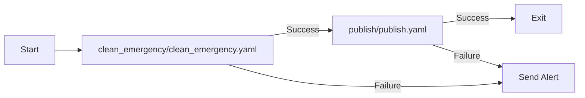
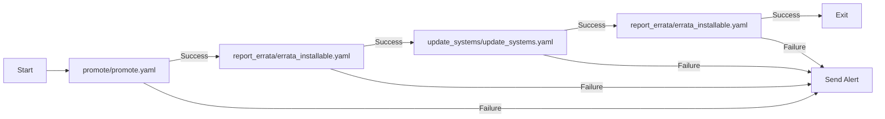
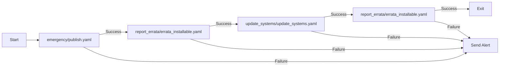

## Publishing

```mermaid
graph LR

Start[Start]    -->          clean_emergency[clean_emergency/clean_emergency.yaml]
clean_emergency -->|Success| publish[publish/publish.yaml]
clean_emergency -->|Failure| alert[Send Alert]
publish         -->|Success| Exit
publish         -->|Failure| alert
```

## Update Systems

```mermaid
graph LR

Start[Start]   -->          promote[promote/promote.yaml]
promote        -->|Success| report_errata[report_errata/errata_installable.yaml]
promote        -->|Failure| alert[Send Alert]
report_errata  -->|Success| update_systems[update_systems/update_systems.yaml]
report_errata  -->|Failure| alert
update_systems -->|Success| report_errata2[report_errata/errata_installable.yaml]
update_systems -->|Failure| alert
report_errata2 -->|Success| Exit
report_errata2 -->|Failure| alert
```

## Emergency Publish

```mermaid
graph LR

Start[Start]   -->          publish[emergency/publish.yaml]
publish        -->|Success| report_errata[report_errata/errata_installable.yaml]
publish        -->|Failure| alert[Send Alert]
report_errata  -->|Success| update_systems[update_systems/update_systems.yaml]
report_errata  -->|Failure| alert
update_systems -->|Success| report_errata2[report_errata/errata_installable.yaml]
update_systems -->|Failure| alert
report_errata2 -->|Success| Exit
report_errata2 -->|Failure| alert
```
